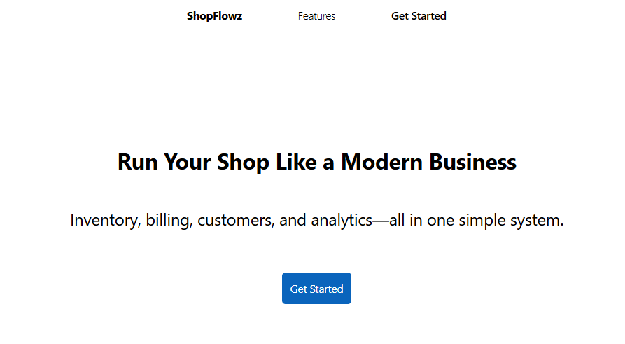

# ShopFlowz Landing Page

## Description
ShopFlowz is a modern landing page for a fictional shop management system that helps businesses run smarter. It showcases features like smart billing, inventory tracking, and customer management—all in one simple system built for modern businesses.

**Live Demo:** [kamran-riyaz.github.io/shopflowz-landing-page/](https://kamran-riyaz.github.io/shopflowz-landing-page/)  
**GitHub Repo:** [github.com/Kamran-Riyaz/shopflowz-landing-page](https://github.com/Kamran-Riyaz/shopflowz-landing-page)

## Tech Stack
- **HTML5**: Semantic markup for structure
- **CSS3**: Modern styling with CSS Grid, Flexbox, and responsive design
- **Fonts**: Inter font family for clean typography

## How to Run Locally
1. Clone or download the project files to your local machine.
2. Navigate to the project directory: `cd shopflowz-landing-page`
3. Open `index.html` in your web browser directly, or use a local server for better experience:
   - If you have Python installed: `python -m http.server 8000`
   - Or use any static file server like Live Server in VS Code.
4. Visit `http://localhost:8000` (or the appropriate URL) to view the page.

## Screenshots

## What I Learned
During this project, I particularly learned how to use CSS Grid.